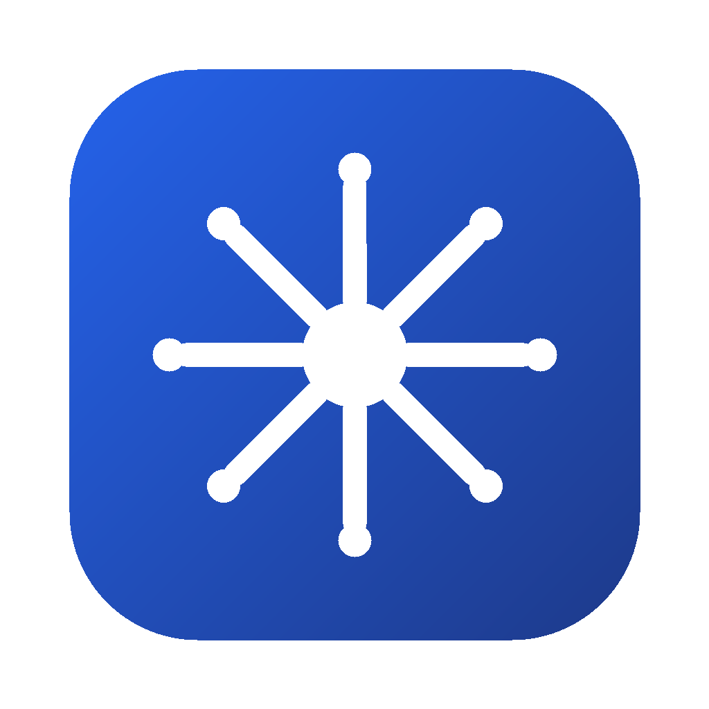
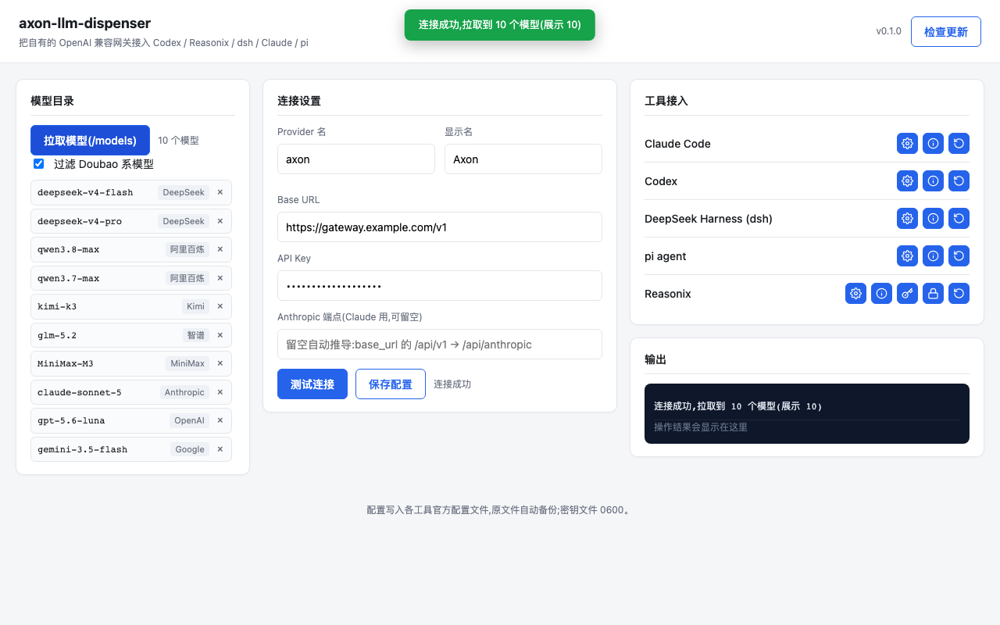
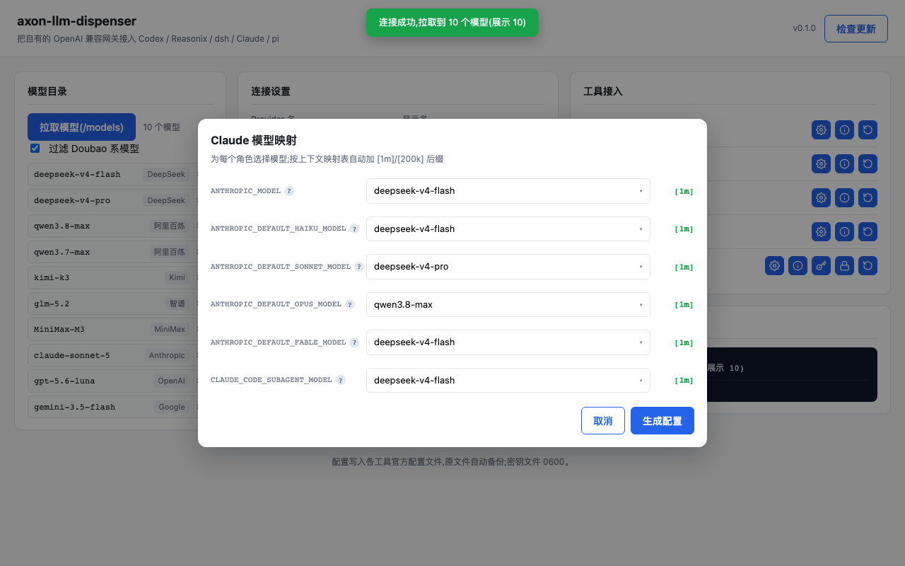
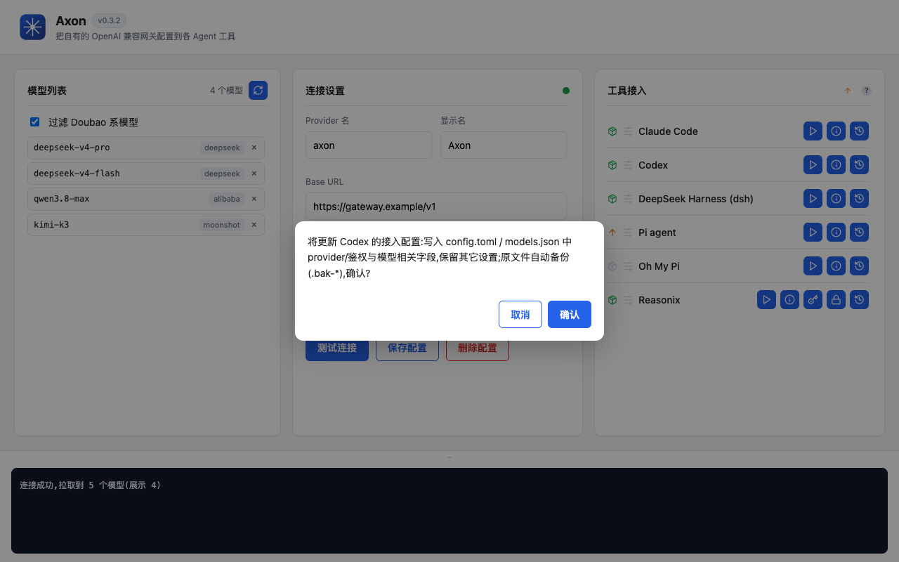
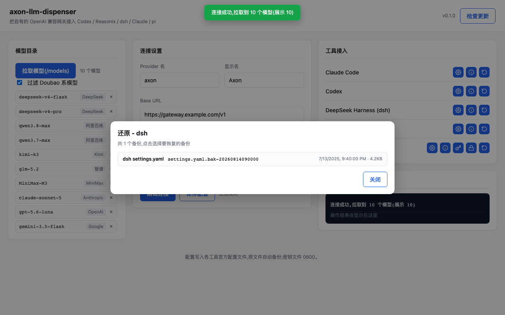

<p align="center">
  
</p>

<h1 align="center">axon-llm-dispenser</h1>

<p align="center">把<strong>你自有的 OpenAI 兼容网关</strong>(任意 <code>base_url</code> + <code>api_key</code>)一键接入 5 个编码 / Agent 工具:<strong>Codex · Reasonix · DeepSeek Harness · Claude Code · pi agent</strong></p>

<p align="center">
  <a href="https://github.com/dncore/axon-llm-dispenser/releases"></a>
  
  
</p>

---

## 功能

### 连接设置
- **Provider 名**：写入各工具的路由名（默认 `axon`，可自定义）
- **Base URL / API Key**：你的 OpenAI 兼容网关地址与凭据
- **Anthropic 端点**（Claude 用，可留空自动推导 `/api/v1 → /api/anthropic`）
- 一键「测试连接」（`GET /models`）并保存配置

### 模型目录（全高侧边栏）
- 拉取 `/models`，每行展示 **模型 ID + 上游厂商**（`owned_by`，如 DeepSeek / 阿里百炼 / Kimi）
- **过滤 Doubao 系模型**开关（默认开启），拉取与生成配置均不含
- 单行移除、实时数量统计

### 工具接入（5 个）
| 工具 | 说明 |
|------|------|
| **Codex** | 写入 `~/.codex/config.toml` + `models.json`（responses 协议） |
| **Reasonix** | 写入 `~/.reasonix/config.toml` `[[providers]]` + `.env`，支持生成 / 关闭固定鉴权 Token |
| **DeepSeek Harness** | 写入 `~/.dsh/settings.yaml`（`llm-pi-ai.providers` + `agent-default-model`）+ `.credentials.yaml` |
| **Claude Code** | 写入 `~/.claude/settings.json` 的 `env` 块，**角色模型映射弹窗** |
| **pi agent** | 写入 `~/.pi/agent/models.json`（`providers`）+ `settings.json`（defaultProvider/Model） |

- 每个工具支持 **配置 / 状态 / 还原**
- 配置前弹确认框（非 Claude），告知覆盖现有配置且**自动备份**（`.bak-*`）
- **还原**：弹窗列出全部备份（文件名 / 时间 / 大小），点选恢复，当前文件先备份 `.bak-pre-restore-*`

### Claude 角色模型映射
为 `主模型 / Haiku / Sonnet / Opus / Fable / 子代理` 各选一个模型，按内置**上下文映射表**（已知模型精确规格 + 正则推断）自动加官方后缀 `[1m]` / `[200k]`，默认值取自你当前的 `~/.claude/settings.json`。

## 截图

> 以下为 **mock 数据**渲染（不包含任何真实凭据）。

| 主界面 | Claude 模型映射 |
|---|---|
|  |  |

| 配置确认 | 备份还原 |
|---|---|
|  |  |

## 使用

1. 打开应用，在「连接设置」填入 Provider 名、Base URL、API Key（可选填 Anthropic 端点）
2. 点「测试连接」拉取模型列表（自动应用 Doubao 过滤）
3. 在「工具接入」点对应工具的 ⚙ 配置（Claude 会弹出角色映射），确认后写入其官方配置文件
4. 需要时用 🔄 从备份还原，Reasonix 可 🔑 生成固定鉴权 Token

## 下载 / 升级

### Homebrew(macOS,推荐)

```bash
brew tap dncore/axon-llm-dispenser
brew trust dncore/axon-llm-dispenser   # 授权 tap 执行安装脚本(postflight 自动移除 quarantine)
brew install --cask axon-llm-dispenser
```

### 手动下载

从 [Releases](../../releases) 下载对应平台便携包，解压即用（免安装）：

| 平台 | 产物 |
|------|------|
| macOS | `axon-llm-dispenser-macos-<版本>.zip`（`.app`，ad-hoc 签名） |
| Windows | `axon-llm-dispenser-windows-<版本>.zip`（便携 exe） |

> macOS 首次打开：右键 →「打开」→「打开」；或 `xattr -dr com.apple.quarantine /Applications/axon-llm-dispenser.app`。

## 从源码构建

```bash
# 前置:Node 20+、Rust、macOS 需 Xcode
npm install
npx tauri dev      # 开发运行
npx tauri build    # 产物 .app/.dmg(macOS) 或便携 zip(Windows, 经 CI)
```

测试: `npx vitest run`

## 技术栈

- **Tauri v2** + TypeScript (Vite),vanilla UI
- 核心配置逻辑为**纯函数**(`src/core/`):Codex/Reasonix/dsh/Claude/pi 的配置补丁 + 模型元数据推断,`vitest` 覆盖
- 适配:macOS / Windows

## License

[MIT](LICENSE)
