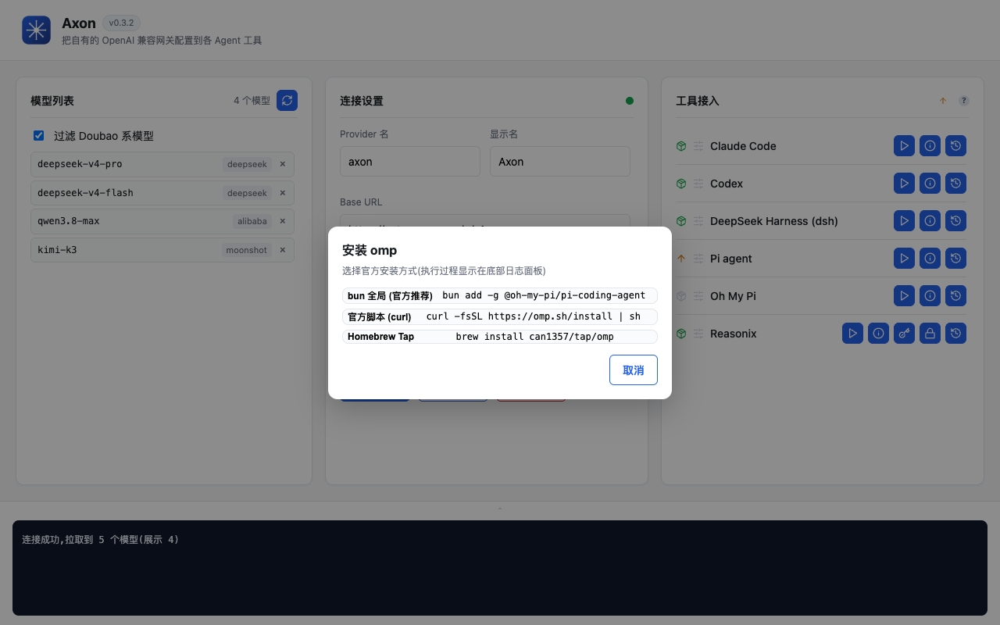

<p align="center">
  
</p>

<h1 align="center">axon-llm-dispenser</h1>

<p align="center">把<strong>你自有的 OpenAI 兼容网关</strong>(任意 <code>base_url</code> + <code>api_key</code>)一键配置到各 Agent 工具(Codex、Claude Code、dsh、Pi、omp、Reasonix 等,持续扩展)</p>

<p align="center">
  <a href="https://github.com/dncore/axon-llm-dispenser/releases"></a>
  
  
</p>

---

## 功能

### 连接设置

- **Provider 名 / 显示名**：写入各工具的路由名与展示名（默认 `axon` / `Axon`）
- **Base URL / API Key**：你的 OpenAI 兼容网关地址与凭据；API Key 输入框带 👁 明文/密文切换
- **Anthropic 端点**（Claude 用，可留空自动推导 `/api/v1 → /api/anthropic`）
- 「测试连接」：`GET /models` 拉取模型并**自动保存配置**；标题行红绿点实时指示连接状态（灰=未测试 / 蓝脉冲=连接中 / 绿=成功 / 红=失败）
- 「删除配置」：一键清除保存的网关配置（config.json），表单恢复初始状态
- 配置保存后重启自动加载并**自动拉取模型列表**（模型列表持久化，刷新不丢）

### 模型列表（左侧全高卡片）

- 拉取 `/models`，每行展示 **模型 ID + 上游厂商**（`owned_by`，如 DeepSeek / 阿里百炼 / Kimi）
- **过滤 Doubao 系模型**开关（默认开启），拉取与生成配置均不含
- 单行移除、实时数量统计

### 工具接入（6 个 Agent）

| 工具 | 写入位置 |
|------|------|
| **Codex** | `~/.codex/config.toml` + `models.json`（responses 协议） |
| **Reasonix** | `~/.reasonix/config.toml` `[[providers]]` + `.env`，支持生成 / 关闭固定鉴权 Token |
| **DeepSeek Harness** | `~/.dsh/settings.yaml`（`llm-pi-ai.providers` + `agent-default-model`）+ `.credentials.yaml` |
| **Claude Code** | `~/.claude/settings.json` 的 `env` 块，**角色模型映射弹窗** |
| **Pi agent** | `~/.pi/agent/models.json`（`providers`）+ `settings.json`（defaultProvider/Model） |
| **Oh My Pi (omp)** | `~/.omp/agent/models.yml`（`providers`）+ `config.yml`（`modelRoles.default`） |

每个 Agent 有**两个状态图标**（均可点击重检）：

- 📦 **安装检测**：绿=已检测到 CLI，灰=未检测到（PATH + 各官方安装方式的常见目录，兼容 macOS/Windows/Linux）
- 🎚 **配置一致性**：绿=写入的 provider 与当前网关 baseUrl/Key 一致，橙=不一致，灰=未配置；「配置」操作成功后自动重检

### 升级 / 安装（按现有安装方式）

- 安装图标变**橙色 ↑** 表示该 Agent 有新版本（tooltip 显示 v1 → v2 与安装方式），点击按现有安装方式升级：npm 全局（fnm/nvm 多版本安全，带 `--prefix <nodeRoot>`）/ pnpm / bun / Homebrew / 官方自更新 / npx 缓存刷新
- **未安装**的 Agent 点击图标可一键安装：按官方方式（curl 脚本 / npm / bun / brew），多方式时弹窗选择
- 标题行 ↑ 按钮**批量升级**全部可升级 Agent（升级中图标进入 loading 脉冲状态）
- 升级/安装过程**逐行实时输出到底部日志面板**，不依赖预装任何辅助工具

### DeepSeek 官方特配

pi 与 omp 的 DeepSeek 模型按 **DeepSeek 官方接入指南**写入优化配置：thinking 等级锁定（`minLevel: high / maxLevel: xhigh / mode: effort`）+ 完整 compat 块（`supportsToolChoice: false` 等三关键字段，缺省思考模式下工具调用会 400）+ pi 的 `thinkingLevelMap`，并自动去 `/v1`（omp）。

### 备份还原

- 每次配置写入自动备份（`.bak-*`）
- 还原弹窗每条备份支持 **▶ 应用（二次确认）/ ✎ 重命名 / 🗑 删除（二次确认）**
- 点击条目打开**查看/编辑**：带行号的配置编辑器，保存/应用均按扩展名校验 **JSON / TOML / YAML** 格式（错误 toast 提示并停留编辑状态）

### 新手引导

- 未配置网关时显示**悬浮引导条**（可关闭），步骤一目了然
- 「模型列表」「工具接入」卡片在**网关连接成功前置灰锁定**（蒙层不可交互），连接成功自动解锁

### 日志面板（底部）

- 操作日志实时滚动输出；**拖拽把手调整高度**，把手上 chevron 按钮单击展开到半屏/收起

## 截图

> 以下为 **脱敏 mock 数据**渲染（不包含任何真实凭据）。

| 主界面 | Claude 模型映射 |
|---|---|
|  |  |

| 配置确认 | 备份还原 |
|---|---|
|  |  |

| 安装方式选择 |
|---|
|  |

## 使用

1. 打开应用，在「连接设置」填入 Provider 名、Base URL、API Key（可选填 Anthropic 端点）
2. 点「测试连接」拉取模型列表（自动应用 Doubao 过滤并保存配置）
3. 在「工具接入」点对应 Agent 的 ▶ 配置（Claude 会弹出角色映射），确认后写入其官方配置文件
4. 图标变橙色 ↑ 时点击升级；未安装的 Agent 点击图标选择官方方式安装
5. 需要时用 ⟲ 从备份还原（支持重命名 / 删除 / 编辑备份内容）

## 下载 / 升级

### Homebrew(macOS,推荐)

```bash
brew tap dncore/axon-llm-dispenser
brew trust dncore/axon-llm-dispenser   # 授权 tap 执行安装脚本(postflight 自动移除 quarantine)
brew install --cask axon-llm-dispenser
```

### 手动下载

从 [Releases](../../releases) 下载对应平台便携包，解压即用（免安装）：

| 平台 | 产物 |
|------|------|
| macOS | `axon-llm-dispenser-macos-<版本>.zip`（`.app`，ad-hoc 签名） |
| Windows | `axon-llm-dispenser-windows-<版本>.zip`（便携 exe） |

> macOS 首次打开：右键 →「打开」→「打开」；或 `xattr -dr com.apple.quarantine /Applications/Axon.app`。

## 从源码构建

```bash
# 前置:Node 20+、Rust、macOS 需 Xcode
npm install
npx tauri dev      # 开发运行
npx tauri build    # 产物 .app/.dmg(macOS) 或便携 zip(Windows, 经 CI)
```

测试: `npx vitest run`（前端纯函数） + `cd src-tauri && cargo test`（Rust: 配置校验 / 升级分类 / CLI 检测）

## 技术栈

- **Tauri v2** + TypeScript (Vite)，vanilla UI
- 核心配置逻辑为**纯函数**（`src/core/`）：各 Agent 的配置补丁 + 模型元数据推断 + 配置一致性检测，`vitest` 覆盖
- Agent 升级/安装逻辑移植自 [agent-update-way](https://github.com/dncore/agent-update-way)（auway）：安装管理器分类 + 对应升级命令，`cargo test` 覆盖
- 适配：macOS / Windows

## License

[MIT](LICENSE)
