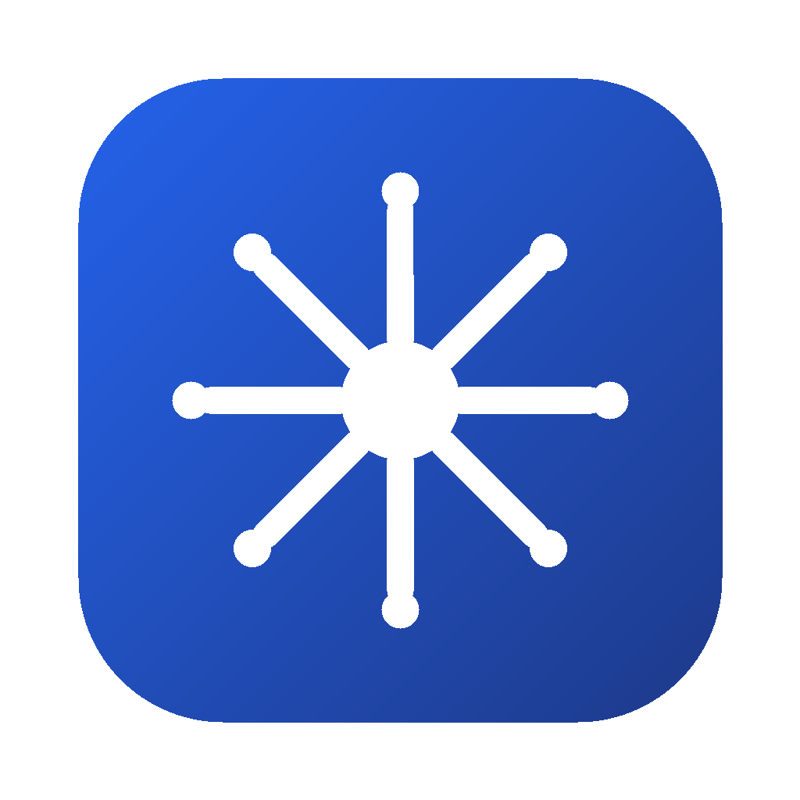
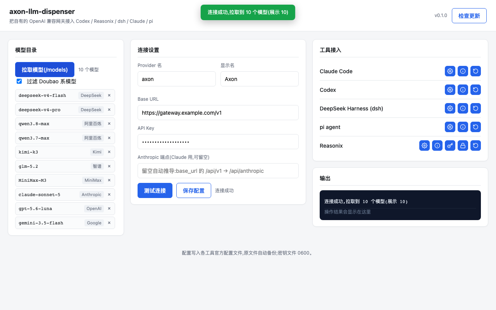
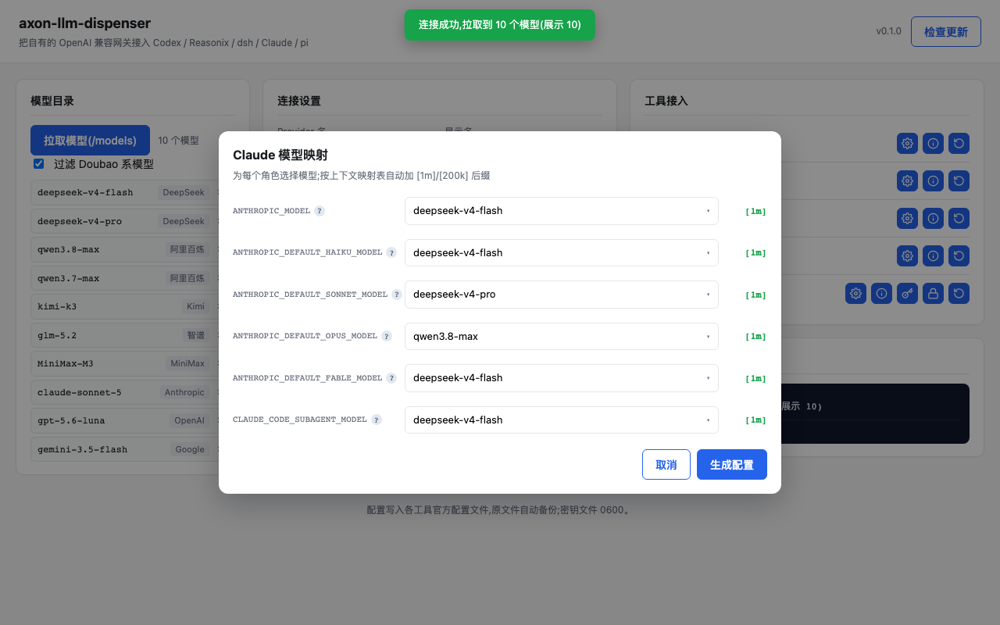
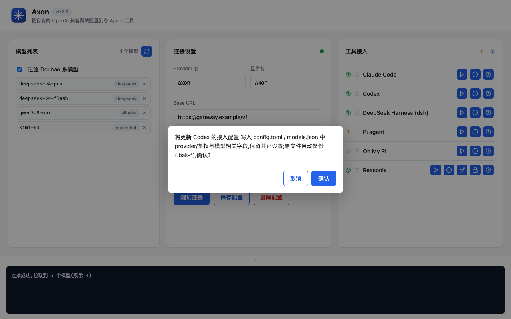
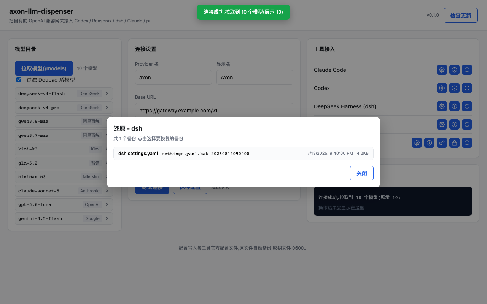
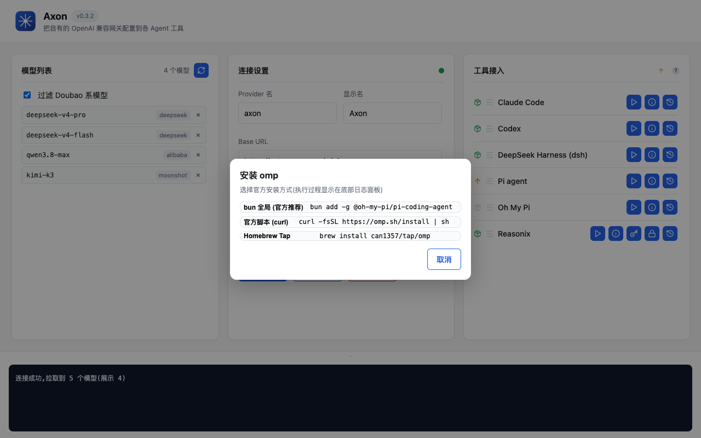

<p align="center">
  
</p>

<h1 align="center">Axon LLM dispenser</h1>

<p align="center">把<strong>你自有的 OpenAI 兼容网关</strong>(任意 <code>base_url</code> + <code>api_key</code>)一键配置到各 Agent 工具(Codex、Claude Code、dsh、Pi、omp、Reasonix、Grok 等,持续扩展)</p>

<p align="center"><em>关于命名：<strong>Axon（轴突）</strong>是神经元的一部分，由神经细胞的细胞本体向外延伸突起，是神经系统中主要的神经信号传递渠道。本项目作为 provider 鉴权分配器，行为非常接近轴突的生物学意义，因此命名 Axon。</em></p>

<p align="center"><em>About the name: <strong>Axon</strong> is part of a neuron — a projection extending outward from the cell body, serving as the primary channel for signal transmission in the nervous system. As a provider-credential dispenser, this project behaves much like an axon in its biological sense, hence the name Axon.</em></p>

<p align="center">
  <a href="https://github.com/dncore/axon-llm-dispenser/releases"></a>
  
  
</p>

---

## 功能

### 连接设置（单套网关 + Codex 账号模式）

- **一套网关配置**：baseUrl / API Key / Anthropic 端点 / 模型列表一份；写入按**每个 Agent 卡片上的「配置」按钮**各自进行（Claude 沿用 settings.json 现有角色映射，Codex 自动处理转换代理与可见模型）
- **Codex 卡片上的「官方账号 / 自建网关」二选一**（本项目唯一与 Codex 专属语义相关的开关）
  - **自建网关**（默认）：config.toml 写 `model_provider` / 顶层 `model` / `model_catalog_json`，经本机转换代理指向你填的网关
  - **官方账号**：撤掉上面三样（`model_provider` 置 `openai`），Codex 走 ChatGPT 登录 + 自带模型目录；`[model_providers.*]` 段保留，随时切回
- **Provider 名 / 显示名**：写入各工具的路由名与展示名（默认 `axon` / `Axon`）；用过的名字会记进 `knownProviders`（改名后旧产物仍能被认出并清理）
- **Base URL / API Key**：你的 OpenAI 兼容网关地址与凭据；API Key 输入框带 👁 明文/密文切换
- **Anthropic 端点**（Claude 用，可留空自动推导 `/api/v1 → /api/anthropic`）
- 「测试」：`GET /models` 拉取模型并**自动保存配置**；标题行红绿点实时指示连接状态（灰=未测试 / 蓝脉冲=连接中 / 绿=成功 / 红=失败）
- 「保存」：只落盘配置（不拉模型）；「删除」：清除保存的网关配置（config.json），表单恢复初始状态
- 配置保存后重启自动加载并**自动拉取模型列表**（模型列表持久化，刷新不丢）
- **历史配置自动迁移**：早期单套配置原样沿用；一度出现过的「多 Provider」配置首次启动收敛为**当前激活的那一套**（其余配置随之删除，它们写进 Codex 的残留由下方「归属与残留清理」规则清理）

### 模型列表（左侧全高卡片）

- 拉取 `/models`，每行展示 **模型 ID + 上游厂商**（`owned_by`，如 DeepSeek / 阿里百炼 / Kimi）
- **「无思考」标记**：命中下方「网关兼容层」的模型（如 `gpt-6-luna`）会标红提示——该模型在本网关上**带工具时思考被强制关闭**（上游限制：`function tools` 与 `reasoning_effort` 互斥，省略该参数也会按非 `none` 默认处理 → 必 400）。**自动挑选默认模型时会跳过这类模型**；你在表单里显式配置的默认模型不受影响。需要「思考 + 工具」请选同网关的其他模型（如 `gpt-5.6-luna`、`deepseek-v4-pro`、`qwen3.8-flash`）
- **过滤 Doubao 系模型**开关（默认开启），拉取与生成配置均不含
- 单行移除、实时数量统计

### 工具接入（8 个 Agent）

| 工具 | 写入位置 |
|------|------|
| **Codex** | `~/.codex/config.toml` + `models.json`（responses 协议） |
| **Reasonix** | `~/.reasonix/config.toml` `[[providers]]` + `.env`，支持生成 / 关闭固定鉴权 Token |
| **DeepSeek Harness** | `~/.dsh/settings.yaml`（`llm-pi-ai.providers` + `agent-default-model`）+ `.credentials.yaml` |
| **Claude Code** | `~/.claude/settings.json` 的 `env` 块，**角色模型映射弹窗** |
| **Pi agent** | `~/.pi/agent/models.json`（`providers`）+ `settings.json`（defaultProvider/Model） |
| **Oh My Pi (omp)** | `~/.omp/agent/models.yml`（`providers`）+ `config.yml`（`modelRoles.default`） |
| **OpenCode** | `~/.config/opencode/opencode.json`（`provider` 块 + 默认 `model`）+ `~/.local/share/opencode/auth.json`（密钥，0600，官方 `opencode auth login` 同款格式） |
| **Grok** | `~/.grok/config.toml` `[model_providers.<name>]`（api_key 明文、chat_completions）+ 每模型 `[model.<id>]` 块（含点号 ID 引号键，context_window 驱动自动压缩）+ `[models]` default；官方 grok 模型保留走官方通道（混合模式，无需 `grok logout`） |

每个 Agent 有**两个状态图标**（均可点击重检）：

- 📦 **安装检测**：绿=已检测到 CLI，灰=未检测到（PATH + 各官方安装方式的常见目录，兼容 macOS/Windows/Linux）
- 🎚 **配置一致性**：绿=写入的 provider 与当前网关 baseUrl/Key 一致，橙=不一致，灰=未配置；「配置」操作成功后自动重检

每行右侧是**两字文字按钮**（悬停有完整说明，卡片标题行的「?」列出全部）：**配置**（写入接入配置）、**刷新**（仅更新模型列表）、**选模**（Codex 可见模型）、**状态**（查看现有配置）、**还原**（从备份恢复）；Reasonix 另有**生成**（鉴权 Token）/ **关闭**（鉴权）。Codex 卡片上的「自建网关 / 官方账号」单独占一行，避免与动作按钮挤在一起折行。

### 刷新模型（仅更新模型列表）

除 Claude Code（无模型列表）外的接入工具（Codex / dsh / omp / Reasonix / OpenCode / Grok）各有一个「**刷新**」按钮，
标题行还有一个「**刷新**」= 刷新全部模型列表（一次刷新所有已接入的 Agent，未接入的自动跳过，单个失败不中断）：

- 只写**模型派生部分**，`base_url` / API Key / 默认模型 / provider 元数据一概不动：
  Codex 只写 `models.json`（不碰 config.toml、不重启转换代理）；dsh / omp 只改 `providers.<name>` 的 `models`；
  Reasonix 只改 `models` + `model_overrides`；OpenCode 只改 `provider.<name>.models`；Grok 只改 `[model.<id>]` 块（default 失效时修正）
- 模型来源 = 左侧**当前模型列表**（Doubao 过滤开关生效）；需要网关最新列表时先点模型卡片标题行的「刷新」拉取
- 条目按 id 识别：新增写入、已有条目只更新管理字段、**网关已下架的条目移除**（非本工具写入的条目/模型块原样保留）
- **内容无变化时不写盘、不产生备份**；写入前的确认框会列出具体变更
- **Codex 可见模型上限 8 个**（`visibility="list"`，ChatGPT/Codex 客户端模型列表超过该数量会渲染错乱）：
  超上限时先弹「Codex 可见模型」选择框让用户在上限内挑（预选 = 该 Provider 上次的选择 + 新模型 + 默认模型，计数 `已选 x/8`），
  未选中的模型以 `visibility="hide"` 写入——不出现在选择器，但仍在目录里（可作默认模型 / `codex -m <id>` 指定）；
  选择结果按 Provider 记住，切换网关后各自沿用（不互相覆盖），**网关新增模型**仍会触发一次挑选。
  想主动改选（不超上限时）用 Codex 卡片的 **选模型** 按钮，只写 models.json 的可见性，不动 config.toml
- **切换 Provider 时 model 跟随**：config.toml 顶层的 `model` 不在新网关模型列表里（旧网关的模型已失效）时自动改写为默认模型并在日志里显示 `model: 旧 → 新`；
  仍在新列表内则保留（尊重你在 Codex 里的选择）；`models.json` 里旧 provider 名下的下架条目一并清理，不在选择器里残留

### 配置写入保留策略

- 所有写入为**合并式补丁**：只 upsert 本工具管理的键——块内你自己加的键、注释、模型条目内的自定义字段（如 per-model 参数）原样保留；
  其他 provider、顶层键、其他 `[model.*]` 块一概不动
- 模型条目按 id 识别合并；归属本工具的条目在网关下架后会随同步移除，**非本工具写入的条目/模型块一律保留**
  （Codex `models.json` 按 description 前缀识别归属，Grok 按 `model_provider` 识别，其余按模型列表归属）
- **归属与残留清理**：Codex 目录条目按 `<provider 名>: …` 前缀 + **本 app 家族署名尾**（`— openai-compatible gateway` / `— /responses OK` / `— /responses not selected`）判定归属。**三个条件同时满足**才清理：① 署名属本 app 家族 ② 该 provider 名既不是当前值、也不在 `knownProviders` 里（典型：那套配置已被删）③ 该模型已不在网关模型列表。同时移除 config.toml 里对应的 `[model_providers.<name>]` 残留段。用户手写、或没有本 app 署名的条目/段一概不动
- 全量「配置」与「刷新」遵循同一套规则；密钥文件（`.env` / `auth.json` / `.credentials.yaml`）不备份、固定 0600

### 升级 / 安装（按现有安装方式）

- 安装图标变**橙色 ↑** 表示该 Agent 有新版本（tooltip 显示 v1 → v2 与安装方式），点击按现有安装方式升级：npm 全局（fnm/nvm 多版本安全，带 `--prefix <nodeRoot>`）/ pnpm / bun / Homebrew / 官方自更新 / npx 缓存刷新
- **未安装**的 Agent 点击图标可一键安装：按官方方式（curl 脚本 / npm / bun / brew），多方式时弹窗选择
- 标题行的「**升级**」按钮（有可升级项时才出现）**批量升级**全部可升级 Agent（升级中图标进入 loading 脉冲状态）
- **OpenCode 安装方式**：有 npm 时只给 `npm install -g opencode-ai`；无 npm 的机器才提供备用方式（macOS `brew install anomalyco/tap/opencode`、Windows winget `SST.opencode`）。升级按已装方式（npm 全局 → `npm update -g`；brew → `brew upgrade`；winget → `winget upgrade --id`；官方二进制 → `opencode upgrade`）
- **Pi 扩展更新**：Pi agent 卡片安装图标旁的橙色 `ext` 角标 = 更新 Pi 扩展（packages），点击确认后执行 `pi update --extensions`（即点即更，无需版本检测；**pi 本体无更新时也可单独更新扩展**）；点击 Pi 主图标升级 pi 时，升级成功后会自动**顺带更新扩展**
- 升级/安装过程**逐行实时输出到底部日志面板**，不依赖预装任何辅助工具

### DeepSeek 官方特配

pi 与 omp 的 DeepSeek 模型按 **DeepSeek 官方接入指南**写入优化配置：thinking 等级锁定（`minLevel: high / maxLevel: xhigh / mode: effort`）+ 完整 compat 块（`supportsToolChoice: false` 等三关键字段，缺省思考模式下工具调用会 400）+ pi 的 `thinkingLevelMap`，并自动去 `/v1`（omp）。

### 网关兼容层（已知网关缺陷的请求形状修正）

canonical 模型表（gist）只记**模型官方规格**；某些网关/渠道的实测行为与规格不符，修正放在两处本地层，不入 canonical、不受 `sync:models` 覆盖，网关修好后删对应条目即回到原生形状：

| 网关缺陷 | 表现 | 本项目的兼容处理 |
|---|---|---|
| `gpt-6-luna`（七牛渠道）在 `/chat/completions` 上 **function tools 与 `reasoning_effort` 互斥**，且**省略该参数时按非 `none` 默认处理** | 带工具的 agent 请求 100% 失败：省略 / `low` / `medium` / `high` 均 400；流式还会被网关降级成 200 + 无信息量的 `Provider returned 400` | pi 侧：`src/core/models.ts` 的 `GATEWAY_OVERLAYS` 把该模型所有思考档（含 `off`、`max`）一律映射为 `reasoning_effort=none`，并置 `supportsReasoningEffort: true`，写入 `~/.pi/agent/models.json`（实测该形状可正常返回 `finish_reason=tool_calls`）<br>Codex 侧：转换代理在带 `tools` 且命中 `gpt-6` 族时显式发 `none`（不再沿用「`none` 一律省略」的旧规则——省略正是该路由的 400 形状），并且不做无意义的剥参数重试 |
| `gpt-6` 族的模型自身 API 变更（上游网关 2026-09-29 说明）：`max_tokens` 废弃 / 不支持 `temperature`·`top_p` / `json_schema` 结构化输出不可用 | 旧形状请求直接 400；「采样式对话 + 工具调用 + 推理」并存的旧工作流整体失效 | Codex 侧：转换代理对 `gpt-6` 族**一律**发 `max_completion_tokens`（不发 `max_tokens`）、剥掉 `temperature`/`top_p`、剥掉 `json_schema` 的 `response_format`（`json_object` 照常），与上面的 tools×effort 规则合并在 `src-tauri/src/proxy.rs` 的 `GPT6_LIMITS_PATTERN` 一处；其余模型不受影响 |
| 同模型的 `/responses` 被网关转成 chat 并注入 `thinking` 参数 | 400 `Unknown parameter: 'thinking'`，即报错里「use /v1/responses」的建议在本网关不成立 | 该模型列入 `CODX_PROXY_CONVERT_PATTERN`，Codex 走 Responses→Chat 转换而非透传 |
| 流式请求挂起（30~60s 连 HTTP 状态都不回） | 客户端只能干等到总超时 | 转换代理对**流式**请求的「上游响应头 / SSE 首字节」设 60s deadline，超时即回明确错误；上游以 200 + 带内 `{"error":…}` 返回时转成 `response.failed` 并保留原始 message，不退化成笼统报错 |

**代价与限制**：`gpt-6-luna` 在本网关上带工具时拿不到思考输出（模型侧 `reasoning_tokens=0`）——这是上游不支持 tools×reasoning 的必然结果，不是代理可绕开的；改走 `/responses` 保思考也被上面的 `thinking` 注入卡住。若网关/上游后续修复，删除 overlay 条目、并复核 `GPT6_LIMITS_PATTERN` 的四条即恢复。

### 备份还原

- **按需备份，不重复备份自己的产物**：写入前比对内容指纹——文件当前内容就是本 app 上次写入的（频繁切换 Provider 覆盖的通常正是这种）则**不新建备份**（最初/上次外部改动前的备份仍在）；
  只有检测到**外部改动**（手工编辑、其它工具写入）时才备份为 `.bak-<时间戳>`；文件不存在（首次写入）无备份
- 还原弹窗每条备份支持 **应用（二次确认）/ 改名 / 删除（二次确认）**
- **「清理自动备份」**：每个文件保留最近 10 个自动备份（`.bak-<时间戳>` 与还原前快照 `.bak-pre-restore-*`），列出待删清单 + 二次确认；
  **手动重命名的备份**（如 `.bak-mcp-disable`）不受影响，历史堆积可一键收拾
- 点击条目打开**查看/编辑**：带行号的配置编辑器，保存/应用均按扩展名校验 **JSON / TOML / YAML** 格式（错误 toast 提示并停留编辑状态）
- 还原时仍会先把当前文件备份为 `.bak-pre-restore-*`（还原是你主动选择的动作，这一步不省）

### 新手引导

- 未配置网关时显示**悬浮引导条**（可关闭），步骤一目了然
- 「模型列表」「工具接入」卡片在**网关连接成功前置灰锁定**（蒙层不可交互），连接成功自动解锁

### 日志面板（底部）

- 操作日志实时滚动输出；**拖拽把手调整高度**，把手上 chevron 按钮单击展开到半屏/收起

## 截图

> 以下为 **脱敏 mock 数据**渲染（不包含任何真实凭据）。

| 主界面 | Claude 模型映射 |
|---|---|
|  |  |

| 配置确认 | 备份还原 |
|---|---|
|  |  |

| 安装方式选择 |
|---|
|  |

## 使用

1. 打开应用，在「连接设置」填入 Provider 名、Base URL、API Key（可选填 Anthropic 端点）
2. 点「测试」拉取模型列表（自动应用 Doubao 过滤并保存配置）
3. 在「工具接入」点对应 Agent 的「**配置**」（Claude 会弹出角色映射）并确认，写入其官方配置文件；
   只更新模型列表（不动 base_url / 密钥）时点该 Agent 的「刷新」，或标题行「刷新」一次全刷
4. 换网关:改 Base URL / API Key → 「测试」拉模型 → 逐个 Agent 点「配置」改写;Codex 想临时用官方账号,点它卡片上的「官方账号」即可(切回点「自建网关」)
5. 安装图标变橙色 ↑ 时点击升级；未安装的 Agent 点击图标选择官方方式安装
6. 需要时点「还原」从备份恢复（支持改名 / 删除 / 编辑备份内容 / 清理自动备份）

## 下载 / 升级

### Homebrew(macOS,推荐)

```bash
brew tap dncore/axon-llm-dispenser
brew trust dncore/axon-llm-dispenser   # 授权 tap 执行安装脚本(postflight 自动移除 quarantine)
brew install --cask axon-llm-dispenser
```

### 手动下载

从 [Releases](../../releases) 下载对应平台便携包，解压即用（免安装）：

| 平台 | 产物 |
|------|------|
| macOS | `axon-llm-dispenser-macos-<版本>.zip`（`.app`，ad-hoc 签名） |
| Windows | `axon-llm-dispenser-windows-<版本>.zip`（便携 exe） |

> macOS 首次打开：右键 →「打开」→「打开」；或 `xattr -dr com.apple.quarantine /Applications/Axon.app`。

### 应用内更新提示

App 会自查新版并给出提示，无需自己盯 Releases：

- **窗口内**：header 右侧出现「发现新版本 vX.Y.Z」提示条；macOS 一键 `brew upgrade --cask`（升级中拦截退出、完成后自动重启），Windows 跳转下载页手动替换便携 exe。窗口从托盘/后台恢复可见或获得焦点时自动重查（30 分钟节流）。
- **托盘**：后台常驻（关窗仅隐藏 / 自启 `--background`）时看不到窗口提示条，检测到新版会把托盘提示改成「Axon LLM dispenser — 发现新版本 vX.Y.Z」，并给托盘菜单加一项「发现新版本 vX.Y.Z」（点击打开主界面升级）。启动约 15s 后首查，此后每 6 小时一次；离线/网络不通时保持现状不误报。

## 从源码构建

```bash
# 前置:Node 20+、Rust、macOS 需 Xcode
npm install
npx tauri dev      # 开发运行
npx tauri build    # 产物 .app/.dmg(macOS) 或便携 zip(Windows, 经 CI)
```

测试: `npx vitest run`（前端纯函数） + `cd src-tauri && cargo test`（Rust: 配置校验 / 升级分类 / CLI 检测）

UI 冒烟: `npm run smoke:ui` —— 无头 Chrome 打开真实构建产物、mock 掉 Tauri IPC（内存文件系统），
跑三组交互断言：**主界面布局**（窗口 1280×800 下每个工具行的动作按钮不折行、不溢出卡片）、**Codex 可见模型上限**（超限弹选择框 / 上限内勾选 / 写盘可见性 / ESC 取消 / 不超限不打扰 / 新增模型再次触发）、
**配置写入与备份策略**（Claude 角色映射写入 / model 跟随改写 / 旧配置迁移 / 残留 provider 清理 / 内容未变不重复备份 / 清理自动备份保留最近 10 个）。
需要系统 Chrome/Chromium（或用 `CHROME_BIN=` 指定）；脚本在 `scripts/ui-smoke/`。

## 技术栈

- **Tauri v2** + TypeScript (Vite)，vanilla UI
- 核心配置逻辑为**纯函数**（`src/core/`）：各 Agent 的配置补丁 + 模型元数据推断 + 配置一致性检测，`vitest` 覆盖
- Agent 升级/安装逻辑移植自 [agent-update-way](https://github.com/dncore/agent-update-way)（auway）：安装管理器分类 + 对应升级命令，`cargo test` 覆盖
- 适配：macOS / Windows

## License

[MIT](LICENSE)
